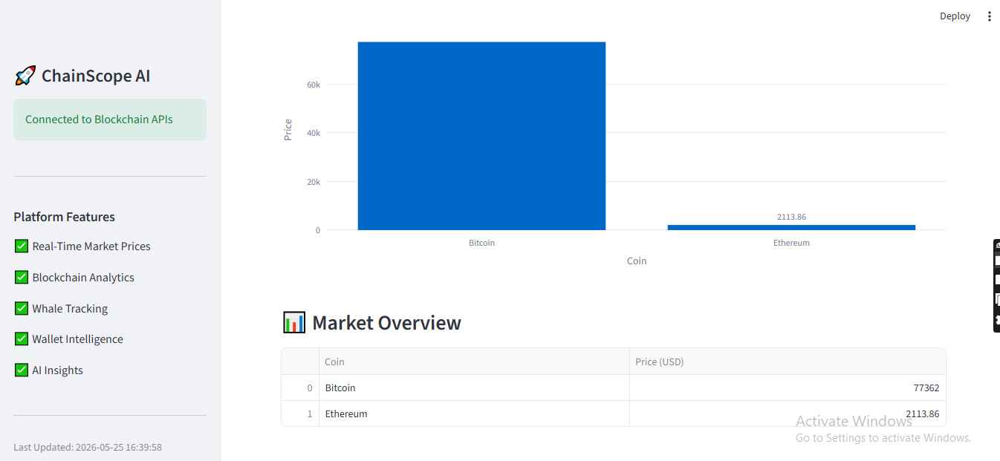

🚀 ChainScope AI

A Real-Time Blockchain Intelligence Platform built with FastAPI, Streamlit, and Blockchain APIs.

ChainScope AI is a full-stack blockchain analytics platform that delivers real-time cryptocurrency market intelligence, wallet analysis, whale transaction tracking, AI-generated insights, and token risk assessment through an interactive web dashboard.

Built to demonstrate modern backend development, API integration, cloud deployment, and production-ready engineering practices.

✨ Features
📈 Real-Time Market Dashboard
Live Bitcoin & Ethereum prices
Interactive market visualization
Real-time crypto overview
🔍 Wallet Intelligence
Ethereum wallet analysis
Recent transaction history
Wallet activity monitoring
📊 Token Analytics
Live token price
Market capitalization
Trading volume
24-hour statistics
🐋 Whale Tracker
Large wallet monitoring
Recent whale transactions
Blockchain activity visualization
🤖 AI Market Insights
Automated token analysis
Trading activity interpretation
Market behaviour insights
🛡️ Risk Assessment
Market-cap analysis
Volume-based risk evaluation
Token risk classification
🌍 Live Demo
🖥️ Frontend

https://chainscope-ai-b3hrzzz4t4enjnfcoayzfn.streamlit.app/

⚙️ Backend API

https://chainscope-ai-ljoa.onrender.com/docs

🏗️ Architecture
                    User
                      │
                      ▼
            Streamlit Dashboard
                      │
                      ▼
              FastAPI Backend
        ┌─────────────┼──────────────┐
        ▼             ▼              ▼
 Binance API   CoinGecko API   Etherscan API
        │             │              │
        └─────────────┼──────────────┘
                      ▼
          Blockchain Intelligence
🛠️ Tech Stack
Backend
Python
FastAPI
REST APIs
Requests
python-dotenv
Frontend
Streamlit
Plotly
Pandas
Blockchain APIs
Binance API
CoinGecko API
Etherscan API V2
Deployment
Render
Streamlit Community Cloud
Version Control
Git
GitHub
📂 Project Structure
chainscope-ai
│
├── backend
│   ├── app
│   │   └── main.py
│   ├── requirements.txt
│   └── .env
│
├── frontend
│   ├── app.py
│   └── requirements.txt
│
├── screenshots
│
├── README.md
└── LICENSE
🔥 Backend Highlights

The backend follows production-ready practices including:

Modular API architecture
Centralized helper functions
Input validation
Ethereum wallet validation
Structured logging
Environment variable management
Robust exception handling
API timeout management
Health monitoring endpoint
Graceful third-party API failure handling
Consistent JSON responses
RESTful API design

---

# 🖼️ Screenshots

### Dashboard

### Main UI

### Wallet Analyzer

### Token Analytics

### Solana Analytics

### Whale Tracker

### Whale Analytics

### AI Insights

### Risk Assessment

---

🚀 Deployment
Service	Platform
Frontend	Streamlit Community Cloud
Backend	Render
Version Control	GitHub
💡 Challenges Solved

During development, several real-world engineering challenges were addressed:

Third-party API integration
Production deployment issues
API rate-limit handling
Invalid input validation
Cloud deployment debugging
Backend reliability improvements
Error handling for external services
Frontend-backend communication
📚 What I Learned

This project strengthened my practical understanding of:

Backend Engineering
REST API Development
FastAPI
Blockchain APIs
Cloud Deployment
Data Visualization
API Integration
Production Debugging
Error Handling
Git & GitHub Workflow
🚀 Future Roadmap
Multi-chain blockchain support
Portfolio Tracker
WebSocket-based live prices
User Authentication
Historical Analytics
AI-based Price Prediction
Notification System
👨‍💻 Author

Harsh Kumar

🎓 B.Tech Information Technology

📧 hk.16.12264@gmail.com

GitHub

https://github.com/Harsh9572

LinkedIn

https://www.linkedin.com/in/harsh-kumar-b9b9a3298

⭐ Support

If you found this project useful, please consider ⭐ starring the repository.